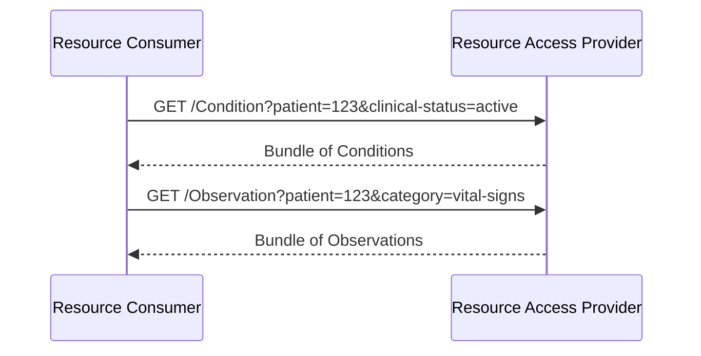

### Overview

Resource access provides query and read access to individual clinical FHIR resources. This is a parallel path to [FHIR Document Exchange](document-exchange.html).

A vaccination registry that serves Immunization resources, or a medication system that serves MedicationStatement resources, uses resource access without necessarily producing complete priority documents. Systems declare which resources they support.

Resource access for resources that also appear within FHIR Documents (e.g., Conditions referenced in a Patient Summary) is permitted but not required.

Data models for resource access inherit from [HL7 Europe Core](https://build.fhir.org/ig/hl7-eu/base/). This path corresponds to [Resource Interoperability Profiles](regulatoryAnchors.html#xt-ehr-deliverable-81-data-model-and-conformance-framework) in the Xt-EHR D8.1 conformance framework, aligned with the Xt-EHR Logical Models.

### Actors

- **Resource Access Provider** (server): Provides resource query capabilities
- **Resource Consumer** (client): Queries resources

See [Actors and Transactions](actors.html) for detailed actor groupings.

<details>
<summary><i>Note: What about Resource Publisher? Click for more</i></summary>

Resource publication is more complex than document publication, and in many cases has resource and use-case specific considerations. Within the scope of this version of the IG, we assume a precondition that the Resource Access Provider has access to resources and focus on defining how the Resource Access Provider enables a consumer to search and read those resources. For more details and possible approaches, see the <a href="resourceExchange.html">Resource Exchange</a> page.

</details>

### Specifications

This IG aligns with:

- [HL7 International Patient Access (IPA)](https://hl7.org/fhir/uv/ipa/) - Primary reference for resource access patterns and CapabilityStatements

### Sequence Diagram



<!-- 
KAR 2026-09-08 Addressing Resource Access tickets:
FHIR-56637, FHIR-56651: Align required search parameters with IPA and describe them, including which are patient-scoped and which are not. Remove "Constraints" since this information is now included with resources.
FHIR-56638, FHIR-56641: Link directly to EU Core profiles and list relevant other resources that are not defined in EU Core, using working list from Issue 9. Clarify which are required to support search, and which are not.
FHIR-56639: Remove "Scopes" section since applicable resources are now listed above. 
KAR 2026-09-23 Updates based on discussion: 
- Point to Patient Matching and Document Exchange in this IG rather than list search patterns for Patient and DocumentReference;
- Add DocumentReference;
- Also consider QEDm.
-->

### Supported Resources

Following [International Patient Access (IPA)](https://hl7.org/fhir/uv/ipa/CapabilityStatement-ipa-server.html), Resource Access Providers are **not required to support all clinical resources**. Servers MAY choose which resources to implement based on their capabilities, use cases, and the regulatory context.

Servers declare which resources they support in their CapabilityStatement (see [Capability Discovery](capability-discovery.html)). Clients MAY check the server's CapabilityStatement to discover available resources before making requests.

See the [Resource Access Provider CapabilityStatement](CapabilityStatement-resource-access-provider-eu-api.html) and [Resource Consumer CapabilityStatement](CapabilityStatement-resource-consumer-eu-api.html) for detailed capability declarations.

#### Core Resources

In the regulatory context of EHDS, the following resources represent individual data entries included in the priority data categories, so should be made available for read/search access if the system claims support for the corresponding priority data category. Data models inherit from [HL7 Europe Core](https://build.fhir.org/ig/hl7-eu/base/). Required search parameters are from [International Patient Access (IPA)](https://hl7.org/fhir/uv/ipa/).

**All priority data categories**
- Patient:
  - Data model: [Patient (EU Core)](https://hl7.eu/fhir/base/StructureDefinition-patient-eu-core.html)
  - Search parameters: As described in the [Patient Matching](https://hl7.eu/fhir/health-data-api/en/patient-match.html) page of this IG.
- DocumentReference:
  - Data model: [MHD DocumentReference Comprehensive](https://profiles.ihe.net/ITI/MHD/StructureDefinition-IHE.MHD.Comprehensive.DocumentReference.html)
  - Search parameters: As described in the [Document Exchange](https://hl7.eu/fhir/health-data-api/en/document-exchange.html) page of this IG.
- Practitioner:
  - Data model: [Practitioner (EU Core)](https://hl7.eu/fhir/base/StructureDefinition-practitioner-eu-core.html)
  - Search parameters: This is not a patient-scoped resource, so there is no requirement for Resource Access Providers to support Search, only Read.
- Organization:
  - Data model: [Organization (EU Core)](https://hl7.eu/fhir/base/StructureDefinition-organization-eu-core.html)
  - Search parameters: This is not a patient-scoped resource, so there is no requirement for Resource Access Providers to support Search, only Read.

**Patient Summary**
- Condition:
  - Data model: [Condition (EU Core)](https://hl7.eu/fhir/base/StructureDefinition-condition-eu-core.html)
  - Search parameters: As described at [IPA CapabilityStatement: Condition](https://hl7.org/fhir/uv/ipa/STU1/CapabilityStatement-ipa-server.html#Condition1-2) and [QEDm 2:3.44](https://profiles.ihe.net/PCC/QEDm/PCC-44.html#234441213-conditions-option-search-parameters). Resource Access Providers are required to support searching by patient, as long as the Resource Consumer provides at least an id value for the Patient resource.
- AllergyIntolerance:
  - Data model: [AllergyIntolerance (EU Core)](https://hl7.eu/fhir/base/StructureDefinition-allergyIntolerance-eu-core.html)
  - Search parameters: As described at [IPA CapabilityStatement: AllergyIntolerance](https://hl7.org/fhir/uv/ipa/STU1/CapabilityStatement-ipa-server.html#AllergyIntolerance1-1) and [QEDm 2:3.44](https://profiles.ihe.net/PCC/QEDm/PCC-44.html#234441212-allergies-and-intolerances-option-search-parameters). Resource Access Providers are required to support searching by patient, as long as the Resource Consumer provides at least an id value for the Patient resource.
- MedicationRequest: 
  - Data model: [MedicationRequest (EU Core)](https://hl7.eu/fhir/base/StructureDefinition-medicationRequest-eu-core.html)
  - Search parameters: As described at [IPA CapabilityStatement: MedicationRequest](https://hl7.org/fhir/uv/ipa/STU1/CapabilityStatement-ipa-server.html#MedicationRequest1-6) and [QEDm 2:3.44](https://profiles.ihe.net/PCC/QEDm/PCC-44.html#234441215-medications-option-search-parameters). Resource Access Providers are required to support searching by patient, as long as the Resource Consumer provides at least an id value for the Patient resource.
- MedicationStatement: 
  - Data model: [MedicationStatement (EU Core)](https://hl7.eu/fhir/base/StructureDefinition-medicationStatement-eu-core.html)
  - Search parameters: As described at [IPA CapabilityStatement: MedicationStatement](https://hl7.org/fhir/uv/ipa/STU1/CapabilityStatement-ipa-server.html#MedicationStatement1-7) and [QEDm2:3.44](https://profiles.ihe.net/PCC/QEDm/PCC-44.html#234441215-medications-option-search-parameters). Resource Access Providers are required to support searching by patient, as long as the Resource Consumer provides at least an id value for the Patient resource.
- Immunization: 
  - Data model: [Immunization (EU Core)](https://hl7.eu/fhir/base/StructureDefinition-immunization-eu-core.html)
  - Search parameters: As described at [IPA CapabilityStatement: Immunization](https://hl7.org/fhir/uv/ipa/STU1/CapabilityStatement-ipa-server.html#Immunization1-4) and [QEDm 2:3.44](https://profiles.ihe.net/PCC/QEDm/PCC-44.html#234441216-immunizations-option-search-parameters). Resource Access Providers are required to support searching by patient, as long as the Resource Consumer provides at least an id value for the Patient resource.

**ePrescription and eDispensation**
- MedicationRequest: 
  - Data model: [MedicationRequest (EU Core)](https://hl7.eu/fhir/base/StructureDefinition-medicationRequest-eu-core.html)
  - Search parameters: As described at [IPA CapabilityStatement: MedicationRequest](https://hl7.org/fhir/uv/ipa/STU1/CapabilityStatement-ipa-server.html#MedicationRequest1-6) and [QEDm 2:3.44](https://profiles.ihe.net/PCC/QEDm/PCC-44.html#234441215-medications-option-search-parameters). Resource Access Providers are required to support searching by patient, as long as the Resource Consumer provides at least an id value for the Patient resource.
- MedicationDispense:
  - Data model: Not included in EU Core. Refer to [MedicationDispense: MPD](https://hl7.eu/fhir/mpd/StructureDefinition-MedicationDispense-eu-mpd.html)
  - Search parameters: Not included in IPA or QEDm. As this is a patient-scoped resource, Resource Access Providers are required to support searching by patient, as long as the Resource Consumer provides at least an id value for the Patient resource.

**Medical Test Results**
- Observation: 
  - Data model: [Observation: Medical Test Result (EU Core)](https://hl7.eu/fhir/base/StructureDefinition-medicalTestResult-eu-core.html)
  - Search parameters: As described at [IPA CapabilityStatement: Observation](https://hl7.org/fhir/uv/ipa/STU1/CapabilityStatement-ipa-server.html#Observation1-8) and [QEDm 2:3.44](https://profiles.ihe.net/PCC/QEDm/PCC-44.html#234441211-simple-observations-option-search-parameters). Resource access providers are required to support Search requests that include both patient and category, both patient and code, all of patient, category, and code, or all of patient, category, and date.
- DiagnosticReport:
  - Data model: [DiagnosticReport (EU Core)](https://hl7.eu/fhir/base/StructureDefinition-diagnosticReport-eu-core.html)
  - Search parameters: As described at [QEDm 2.3.44](https://profiles.ihe.net/PCC/QEDm/PCC-44.html#234441214-diagnostic-reports-option-search-parameters) (not included in IPA). Resource Access Providers are required to support searching by patient and category, all of patient, category, and code, or all of patient, category, and date.

**Imaging Results**
- DiagnosticReport:
  - Data model: [DiagnosticReport (EU Core)](https://hl7.eu/fhir/base/StructureDefinition-diagnosticReport-eu-core.html)
  - Search parameters: As described at [QEDm 2.3.44](https://profiles.ihe.net/PCC/QEDm/PCC-44.html#234441214-diagnostic-reports-option-search-parameters) (not included in IPA). Resource Access Providers are required to support searching by patient and category, all of patient, category, and code, or all of patient, category, and date.
- ImagingStudy:
  - Data model: Not included in EU Core. Refer to [ImagingStudy: General](https://hl7.eu/fhir/imaging/en/StructureDefinition-ImagingStudyEuImaging.html) from HL7 Europe Imaging Report
  - Search parameters: Not included in IPA or QEDm. As this is a patient-scoped resource, Resource Access Providers are required to support searching by patient, as long as the Resource Consumer provides at least an id value for the Patient resource.

**Discharge Reports**
- Encounter:
  - Data model: Not included in EU Core. Refer to [Encounter (HDR)](https://hl7.eu/fhir/hdr/StructureDefinition-encounter-eu-hdr.html)
  - Search parameters: As described in [QEDm 2:3.44](https://profiles.ihe.net/PCC/QEDm/PCC-44.html#234441218-encounters-option-search-parameters). Resource Access Providers are required to support searching by patient or patient and date.


<div markdown="1" class="stu-note">

This is a core subset of resources for ballot. Ballot feedback is requested on whether this set is appropriate. See [Open Issue #9](open-issues.html#issue-9-core-resource-set-validation).

</div>

### Example Queries

```
GET /AllergyIntolerance?patient=123
GET /Condition?patient=123&clinical-status=active
GET /Observation?patient=123&category=vital-signs&date=ge2024-01-01
GET /DiagnosticReport?patient=123&category=LAB
GET /MedicationRequest?patient=123&status=active
```

### Derived Resources
<!--
 KAR 2026-09-08
 FHIR=56640: source for derived resource could be DocumentReference or FHIR document bundle
-->
Derived resources SHOULD include a reference to their source, which may be a DocumentReference or a FHIR Document Bundle (Bundle.type = 'document').

```json
{
  "resourceType": "Provenance",
  "target": [{"reference": "Observation/123"}],
  "entity": [{
    "role": "source",
    "what": {"reference": "DocumentReference/abc"}
  }]
}
```

```json
{
  "resourceType": "Provenance",
  "target": [{"reference": "Observation/123"}],
  "entity": [{
    "role": "source",
    "what": {"reference": "Bundle/abc"}
  }]
}
```

The [IHE mXDE](https://profiles.ihe.net/ITI/mXDE/index.html) profile provides more detail on how to extract resources from documents while maintaining provenance.

### References

- [HL7 International Patient Access (IPA)](https://hl7.org/fhir/uv/ipa/)
- [IHE mXDE](https://profiles.ihe.net/ITI/mXDE/index.html)
- [Actors and Transactions](actors.html)
